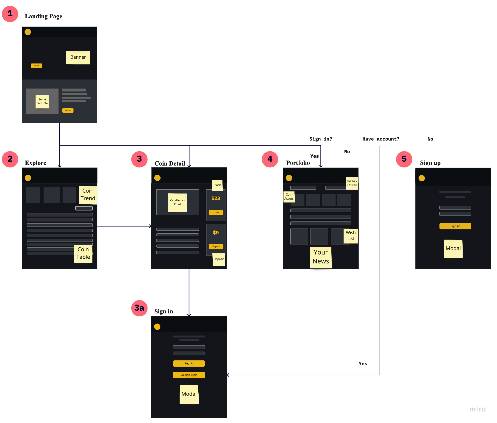

#  Cryptocurrency Exchange

A platform allows user to simulate the transaction process of cryptocurrency and acquire cryptocurrency information in real-time.

## Website Link

Link: <https://cryptocurrency-0511.web.app/>\
Use Google account to login.\
You can also create your own native account or use default test account below.\
**User: test@test.com**\
**Password: test123**

## Techniques

- Front-End Web Design
  - HTML / CSS / JavaScript
  - Responsive Web Design (RWD)
- Frameworks & Library
  - React (Hooks)
  - React Router
  - Redux
- Firebase
  - Authentication
  - Firestore
  - Functions
  - Hosting
- Packages
  - axios
  - highcharts-react-official
  - prop-types
  - react-content-loader
  - react-custom-scrollbars-2
  - react-input-autosize
  - styled-components
- Other
  - CI / CD: GitHub Actions
  - Lint Tool: ESLint with airbnb style
  - Version Control : Git / GitHub
  - Unit Test: Jest

## Structure

## Demo

### Main Page

### Explore Page

- Trend Coin
- Coins Table
- Search Coin
- Pagnation

### Coin Detail Page

- Candlestick Chart
- Trade
- Deposit
- Chat box
- Lastest Trades

### Portfolio Page

- 24Hr PNL calculation
- Wishlist
- YourNews

## Future Features

- Adopt Next.js to have better reduce loading time and get better SEO.
- Build back-end Sever to integrate market price features into the website.

## Contact

If you got any problem when using Cryptocurrency Exchange, or had any suggestion about it. Please feel free to contact with me via email.

- Author: Oakley, Liu
- E-mail: <face9923029@gmail.com>
